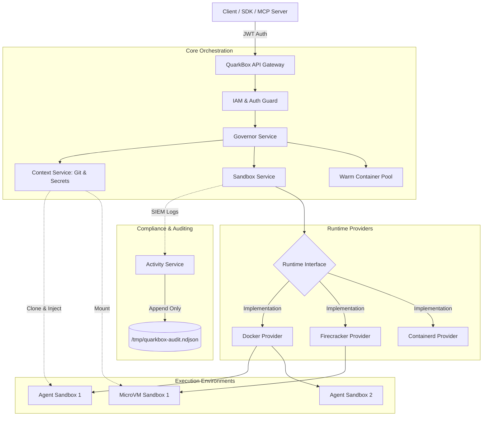
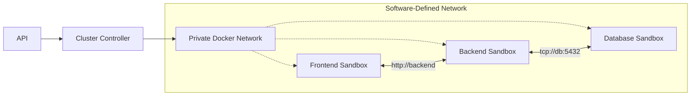
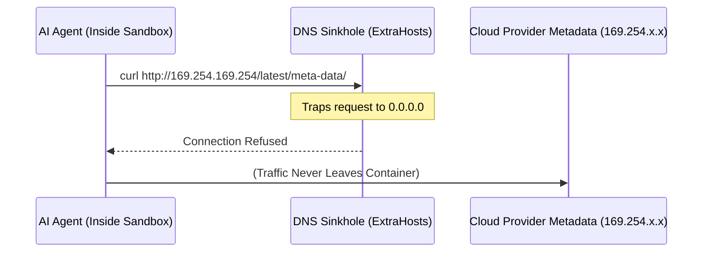

# QuarkBox Architecture

QuarkBox is a multi-tenant, enterprise-grade AI agent sandbox execution platform. It provides isolated, ephemeral runtime environments (Docker/Firecracker) with strict network controls, contextual injection (Git, Secrets), and deep telemetry.

## System Overview

## Software-Defined Cluster Mesh

QuarkBox supports linking multiple sandboxes into an isolated cluster mesh for multi-agent workflows or full-stack application testing.

## Security & Network Isolation

Every sandbox is explicitly hardened against SSRF and cloud metadata exfiltration.

