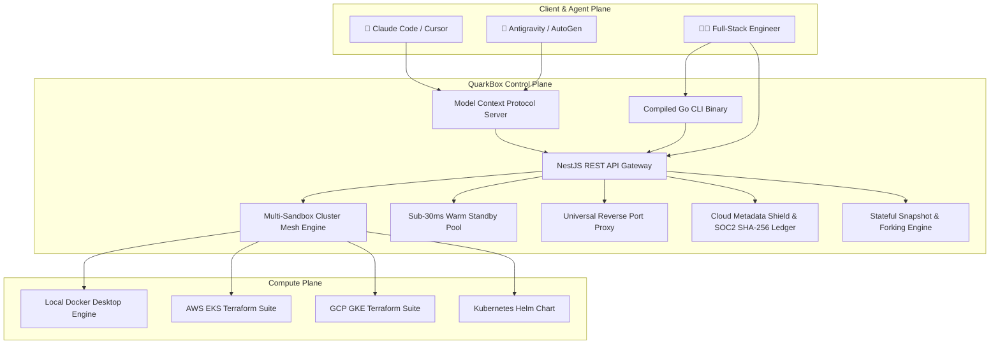

# ⚛️ QuarkBox

> **Secure, elastic cloud sandbox & multi-service cluster platform for AI coding agents and developers.**

[](https://opensource.org/licenses/MIT)
[](https://golang.org)
[](https://nodejs.org)
[](https://docker.com)
[](https://modelcontextprotocol.io)

QuarkBox provides instant (<30ms warm pool), isolated, stateful compute environments and multi-sandbox cluster meshes designed specifically for autonomous AI agents (Claude Code, Cursor, Antigravity, AutoGen, CrewAI) and full-stack developers.

---

## 🏛️ Architecture



---

## ⚡ Key Features

- **🌐 Multi-Sandbox Cluster Mesh**: Spin up heterogeneous topologies (Frontend + Backend + DB) over an isolated private Software-Defined Network (SDN) with automatic internal DNS resolution (`http://backend:8000`).
- **⚡ Sub-30ms Warm Standby Pools**: Instant container claims from pre-warmed idle pools with atomic concurrency locking.
- **🛡️ Cloud Metadata Exfiltration Shield**: Hard blocks malicious queries to `169.254.169.254` (AWS/GCP IMDS) to prevent credential theft.
- **💾 Stateful Snapshots & 1-Click Forking**: Commit runtime state into binary images and branch clone containers in `<100ms`.
- **🔄 Universal Reverse Port Proxy**: Expose any internal container port (`3000`, `8000`, `5173`) with instant live web preview without manual Ingress or DNS configuration.
- **📜 SOC2 Type II Audit Ledger**: Cryptographic SHA-256 HMAC integrity digest chaining for every command, file write, and container event.
- **🤖 Native MCP Agent Protocol**: First-class MCP server tools (`launch_cluster`, `launch_golden_template`, `exec_command`, `get_sandbox_stats`).

---

## 📦 Golden Marketplace Templates

| Slug | Template Name | Category | Base Image | Default Resources |
| :--- | :--- | :--- | :--- | :--- |
| `nextjs15-fullstack-dev` | Next.js 15 & React 19 Full-Stack | Web & Full-Stack | `node:20-alpine` | 2 vCPU / 2GB RAM |
| `langgraph-agent-harness` | LangGraph & CrewAI Agent Harness | AI & Autonomous Agents | `python:3.12-slim` | 4 vCPU / 2GB RAM |
| `pytorch-cuda-studio` | PyTorch & Transformers ML Studio | Data Science & ML | `python:3.12-slim` | 4 vCPU / 4GB RAM |
| `fastapi-pgvector-microservice` | FastAPI & Postgres pgvector Backend | Systems & Backend | `python:3.12-slim` | 2 vCPU / 1GB RAM |
| `go-microservices-grpc` | Go 1.22 Cloud Microservices & gRPC | Systems & Backend | `golang:1.22-alpine` | 2 vCPU / 1GB RAM |
| `rust-wasm-systems` | Rust 1.82 & WebAssembly Studio | Systems & Backend | `rust:1.82-slim` | 4 vCPU / 2GB RAM |
| `devops-cloud-toolchain` | DevOps, Terraform & K8s Toolchain | DevOps & Tooling | `ubuntu:22.04` | 2 vCPU / 2GB RAM |
| `claude-code-dev-workspace` | Claude Code & AI Engineer Workspace | AI & Autonomous Agents | `ubuntu:22.04` | 4 vCPU / 4GB RAM |

---

## 💻 Go CLI (`quarkbox`)

```bash
# Compile CLI binary
cd packages/cli && go build -o bin/quarkbox main.go

# Check API health
./packages/cli/bin/quarkbox health

# List Golden Marketplace Templates
./packages/cli/bin/quarkbox template list

# 1-Click Launch Template
./packages/cli/bin/quarkbox template launch nextjs15-fullstack-dev --name my-app

# Execute command inside container
./packages/cli/bin/quarkbox sandbox exec <sandbox-id> -- node -v

# Inspect Linux cgroup telemetry (CPU, RAM vs Cache, Disk I/O, PIDs)
./packages/cli/bin/quarkbox sandbox stats <sandbox-id>

# Manage Multi-Sandbox Clusters
./packages/cli/bin/quarkbox cluster list
./packages/cli/bin/quarkbox cluster get <cluster-id>
./packages/cli/bin/quarkbox cluster delete <cluster-id>
```

---

## 🚀 Quick Start

### Prerequisites
- Node.js >= 20
- Docker Engine / Docker Desktop
- Go >= 1.22 (for CLI)

### Installation & Local Run
```bash
# Install dependencies
npm install

# Start API server in dev mode
cd packages/api && npm run start:dev

# Start MCP Server
cd packages/mcp-server && npm run build && npm start
```

### Development Quick-Start

```bash
npm install                # install all workspaces
npm run dev                # docker compose up (Postgres/Redis) + start API on :3000
npm run dev:dashboard      # start Next.js dashboard on :3001
cp deploy/docker/.env.example packages/api/.env   # then set JWT_SECRET, etc.
curl http://localhost:3000/api/health              # verify API is up
```

See [docs/GETTING_STARTED.md](docs/GETTING_STARTED.md) for a full walkthrough.

---

## 📚 Documentation

- **[API Reference](packages/api/API.md)** — every REST endpoint (auth, sandboxes, snapshots, clusters, activity, webhooks, plan, proxy) with request/response schemas and curl examples.
- **[Getting Started](docs/GETTING_STARTED.md)** — prerequisites, local setup, env vars, and creating your first sandbox.
- **[Deployment](docs/DEPLOYMENT.md)** — Docker Compose & Kubernetes (Helm) deployment, values reference, env var reference, secrets, scaling, and health checks.
- **[Security](docs/SECURITY.md)** — auth model, container isolation, network policies, and a pre-release checklist.
- **[Troubleshooting](docs/TROUBLESHOOTING.md)** — common issues with symptom → cause → fix.
- **[Data Migration](docs/MIGRATION.md)** — schema management, backing up SQLite, and migrating to Postgres.

---

## 🧪 Real Test Suites

```bash
# 1. Real-World AI Agent Production Use Cases Suite
node test-real-use-cases.mjs

# 2. Multi-Sandbox Cluster Mesh & Isolated SDN DNS Test
node test-cluster-mesh.mjs

# 3. Master Integration Test Suite
./test-live-suite.sh
```

---

## 📄 License

MIT © [QuarkBox Team](https://github.com/samuelvinay91/quarkbox)
